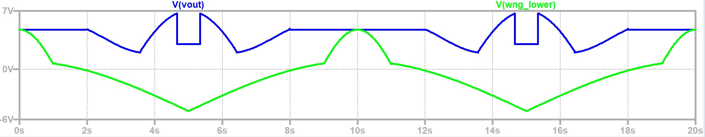

# 🦇 Batman Logo Analog Circuit (LTspice)

This project generates a **Batman logo waveform** using pure **analog circuitry** designed and simulated in **LTspice**.

## ⚡ Overview

The circuit consists of three major sections:

1. **Voltage Source Section** – Provides DC and sinusoidal signals that act as inputs throughout the whole schematic.
2. **Upper Logo Section** – Contains comparators, differentiator, cmos combinational circuits, and analog switches to form the top curvature of the Batman logo.
3. **Lower Logo Section** – Includes similar circuitry and precision full wave bridge rectifier for the bottom contour of the logo.

Two final output ports (`vout_upper` and `vout_lower`) together produce the complete **Batman symbol** when plotted against time.

## 🧠 Circuit Components

- **Op-Amps:** Used in precision full-wave rectifier, comparator, and differentiator.
- **Analog Switches:** Implemented using ADG1219 (SPDT) and ADG1201 (SPST) CMOS-based control circuits.
- **Comparators:** Used to generate multiple control signals needed in analog switches.
- **Differentiator:** Provides slope-based signal control logic.
- **Control Logic:** Multiple CMOS combinational circuits generate selection signals for switch control.

## 📈 Simulation

| Output                                     | Description                                                |
| :----------------------------------------- | :--------------------------------------------------------- |
|  | Simulated output waveform showing the Batman logo pattern. |

- Simulation performed in **LTspice 24.1**.
- Both upper and lower outputs plotted against time.
- Each section responds to carefully timed voltage sources.

## 🔧 Files Included

| File                      | Description             |
| ------------------------- | ----------------------- |
| `circuit/batman_logo.asc` | LTspice schematic file  |
| `circuit/batman_logo.net` | Generated SPICE netlist |
| `circuit/sim_log.txt`     | Simulation log          |
| `image/logo_v3.png`       | Output waveform image   |

## 🚀 Future Work

- Replace multiple input sources with **fewer DC + one sine input**, where other internal signals are derived from these.
- Modularize design into subcircuits:
  - Comparator
  - Precision Rectifier
  - Differentiator
  - CMOS OR and NOT gate
